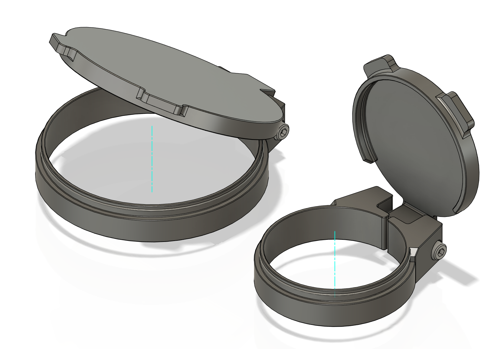

# 3D Printable Rifle Scope Flip Up Cover

The original design in Fusion 360 is also supplied to allow the modder to create the cover with specific diameter.

## Print Parameters

* Primary Material: ABS/PETG/PLA you name it.
* 4x walls
* 5x tops and bottoms layers.
* 0.4~0.45mm line width
* 40% infill.

## BOM

* 1x M3x30 SHCS
  
  

## Supported Rifle Scopes

### Arken EP5

